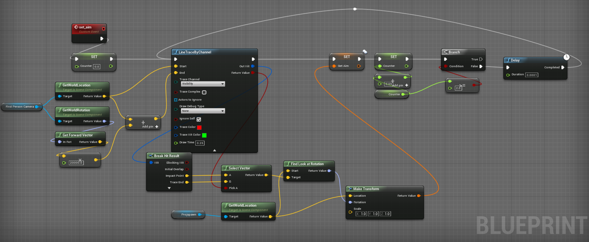
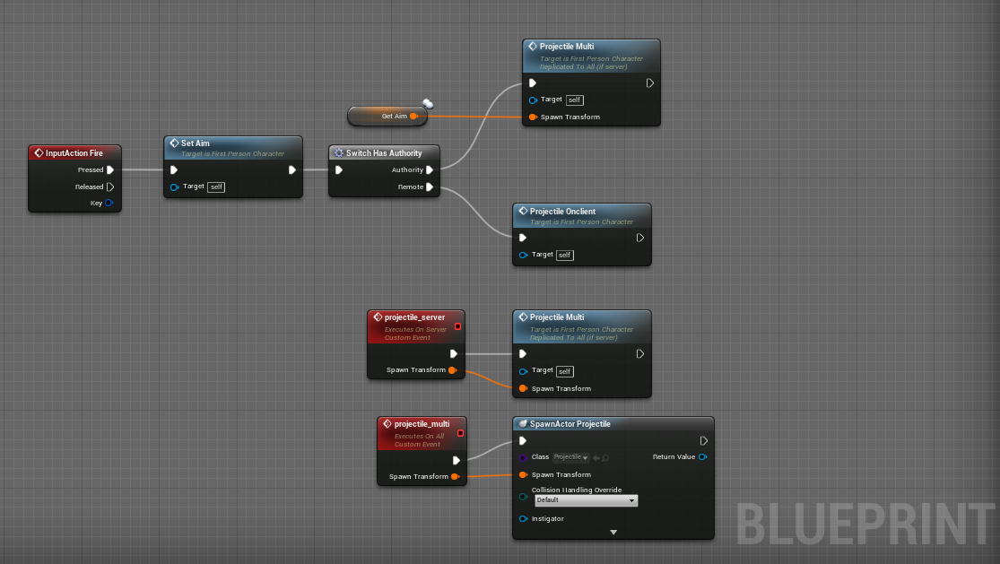
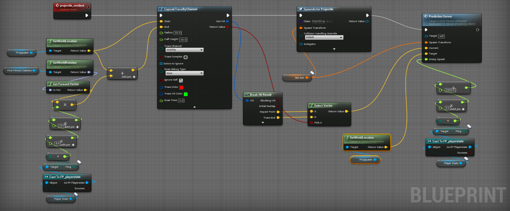
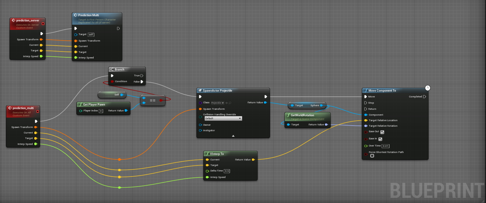

# UE4 Netcode With BP's and C++

**Engine:** UE4

**Language:** UE4 Blueprints / C++

I created a projectile prediction system with UE4 blueprints, in order to help with hit registration on P2P multiplayer in UE4. Below you will see a 200 ping simulation with the prediction system on and off. 

*Notice the difference in timing when the projectile hits the wall.*

Lets say you join a game with your friend on a peer to peer server and you're maintaining 200ms of latency. When you shoot, this means its going to take 200ms in order for that input signal to reach the server. This already sounds super unplayable. One way to fix this issue is to purchase a server and avoid P2P, but that can become expensive. 

How it works: Essentially, you create a fake projectile that only exists on the client, the ping value is then sent through with the replicated function and the position of the projectile will be adjusted depending on the players ping.

### The Break Down

**Projectile Direction**

The first part of the BP is to set a direction for the projectile to spawn and travel. This value is stored in a transform variable called "Get Aim" for later use. This line trace is looped in case the weapon shoots multiple projectiles in a small amount of time. If it is not looped, then the anything after the first shot will spawn in the location of your first projectile. 

**Input Action**

When we fire the shot, we call the "Set Aim" function above. Then the function is replicated on the server but not yet on the client. The server can spawn projectile using a normal replication set up, because the server essentially has 0 ping on P2P. However, for the client to shoot a projectile, we have to spawn a fake projectile and send the ping values through the replicated function.

**Fake Projectile**

The reason why its a "fake" projectile is because it is not something that is being replicated, it is only spawning on the client side. This is done to avoid the 200ms lag before actually seeing your projectile spawn.

When "Projectile Onclient" function is called, there is a second line trace. This line trace is the interpolation distance which the server is allowed to interpolate. If there is an obstruction, then the server will know that it cannot interpolate past that point.

After the line trace is drawn, the client side projectile is spawned with using the "Get Aim" transform location. Then we call "Prediction Server" function, sending the interpolation distance and the player ping through replication.

***Fun Fact***
* The interpolation distance will shorten or lengthen depending on your ping value.
* If you shoot someone who is close to you, the interpolation distance will be adjusted.

**The Prediction**

Finally, the prediction. We called this function above and sent the interpolation and ping values through replication. 

In order to avoid allowing the client to see both projectiles we make sure this function is only seen by the server and all other clients. Then we spawn the projectile and move its predicted location using "VInterp To". The higher the ping, the farther the projectile will be moved.

There is a lot to improve with this system, but it is a quick and cheap solution to UE4's basic networking.
